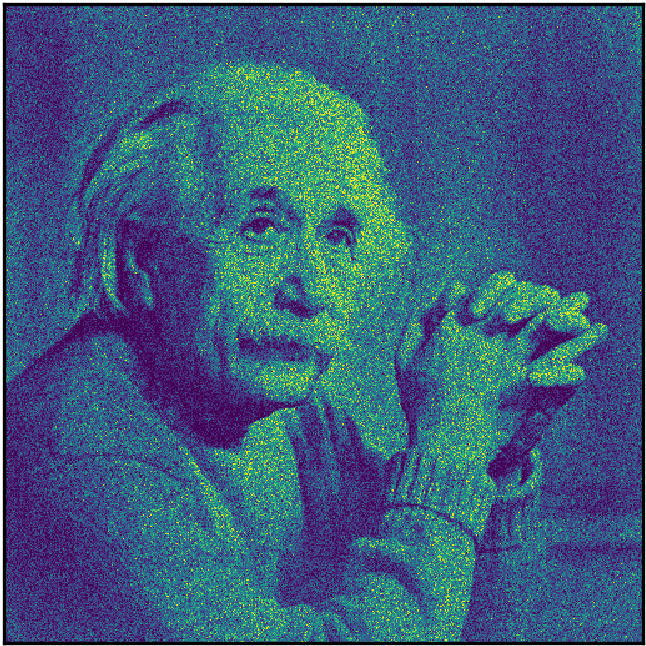

# Autoregressive Energy Machines

This repo contains an implementation of the Autoregressive Energy Machine, outlined in the paper:

> C. Nash, C. Durkan, _Autoregressive Energy Machines_. 2019. [[arXiv]]()

We include reference models for both TensorFlow and PyTorch.

<p align="center">
  
  
  
</p>

### Running the code

#### TensorFlow

#### PyTorch
First, add both the ```src``` and ```pytorch``` directories to your Python path. Then, ```cd``` to the ```experiments``` directory and run
```
python <experiment>.py --<args>
```
where ```<experiment>``` is one of 
- ```plane```
- ```face```
- ```uci```
to run the corresponding experiment with default settings. The ```plane``` script includes the spirals, checkerboard, and diamond experiments, the ```face``` script corresponds to the Einstein experiment, and the ```uci``` script includes all UCI experiments, as well as BSDS300. All experimental details are outlined in the paper's supplementary material, and can be specified using ```<args>```.

Training metrics and model checkpoints can also be saved at specified intervals. Intermediate visualization is also available for the ```plane``` and ```face``` tasks.
